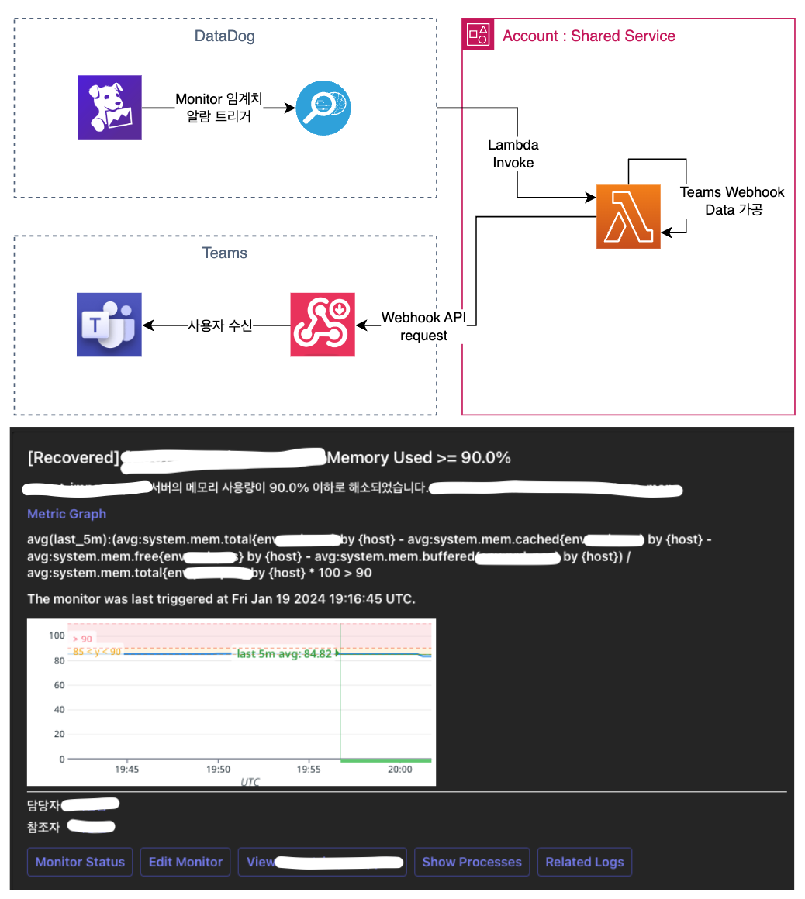

# DataDog Teams

데이터독 팀즈 알람 람다 

## Architect

{height=400px width=500px}

## Installation

Requirement : Node 20 

```bash
npm install
```

## PayLoad

|JSON KEY|Value Type|설명|비고|
|:---:|:---:|:---:|:---:|
|body|string|알람 내용|고정: 수정 필요 없음|
|date|string|최초 발생 일시|고정: 수정 필요 없음|
|event_type|string|이벤트 타입|고정: 수정 필요 없음|
|id|string|알람 아이디|고정: 수정 필요 없음|
|last_updated|string|업데이트 일시|고정: 수정 필요 없음|
|org|json|DataDog Org 정보|고정: 수정 필요 없음|
|people|array|참조자,담당자|변경: 수신인 메일, 이름, 타입(cc,assignee)|
|webhook_url|string|Teams 수신 Webhookurl|변경 : Webhook URL|


```json
{
    "id": "$ID",
    "last_updated": "$LAST_UPDATED",
    "event_type": "$EVENT_TYPE",
    "title": "$EVENT_TITLE",
    "date": "$DATE",
    "org": {
        "id": "$ORG_ID",
        "name": "$ORG_NAME"
    },
    "image" : "$SNAPSHOT",
//Webhook 마다 변경 되는 값
    "webhook_url": "https://shinsegaegroup.webhook.office.com/webhookb2/119c3c64-f95e-4f23-8f55-ea104b99b916@d4ffc887-d88d-41cc-bf6a-6bb47ec0f3ca/IncomingWebhook/a65a3123fbd946a89c0e612a97def23d/53aaa41e-9ad8-4abd-b6d9-bfa20e245721",
    "body": "$EVENT_MSG",
//webhook 마다 변경 되는 값
    "people": [
        {
            "mail": "dalgun@emart.com",
            "name": "권달마",
            "type" : "assignee"
        },
        {
            "mail": "junseok.lee@emart.com",
            "name": "이준석",
            "type" : "cc"
        }
    ]
}
```

## Contributing

master branch : pull request 이후 merge

lambda 명으로 branch 생성 후 배포 테스트 진행 (author 기재 필요)


## License

[MIT](https://choosealicense.com/licenses/mit/)